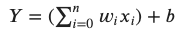

# Machine learning
* [cheat sheet](https://ml-cheatsheet.readthedocs.io/en/latest/)
* finds rules based on data
* AI > ML > NN

## [basics](https://colab.research.google.com/drive/1F_EWVKa8rbMXi3_fG0w7AtcscFq7Hi7B#forceEdit=true&sandboxMode=true)
* `feature` - input data, what we feed the model to get an output
* `label` - output data, what we are looking for
* `feature` --> `label`
* `training data`- what we feed to the model so that it can develop and learn. It is usually a much larger size than the testing data
* `testing data`- seperate set of data to evaulate the model, and see how well it is performing
 
## [learning](https://colab.research.google.com/drive/15Cyy2H7nT40sGR7TBN5wBvgTd57mVKay#forceEdit=true&sandboxMode=true)
* `supervised` - tweaks algorithms with entered data
* `unsupervised` - don't have labels, algorithm figures it out
* `reinforcement` - train model through rewards in uncertain environment

### tensor basics
* `rank / degree` - number of dimentions involved in the tensor
  * `tf.rank(tf.Variable())` to get the rank
  * rank 0 (scalor) - `tf.Variable("something", tf.string)`
  * rank 1 - `tf.Variable(["something", "another"], tf.string)`
  * rak 2 - `tf.Variable([["something", "another"], ["one", "two"]], tf.string)`

* `shape` - the amount of elements in each dimention
  * `tf.Variable().shape`
  * `TensorShape[2,3]` - `tf.Variable([["something", "another", "anything"], ["one", "two", "three"]], tf.string)`
  * `reshape` - modify the shape of the tensor
    * number of elements in a tensor is the product of the sizes of all its shapes

## algorithms

### useful libraries
* `tensorflow as tf`
* `matplotlib.pyplot as plt`
* `numpy as np`
* `pandas as pd`
* `sklearn`

### feature columns
* list of categorical and numeric data points
* create object that our model can use to map categorical data points (strings) to integer values

### training process
* stream batch of 32
* `epochs` - number of times we send the same data batch to the model

### input function
* convert `pandas` dataframe into `tf.data.Dataset` object that is required for `tensorflow` to make a model

### linear regression
* regression is used to predict a numeric value
* `y = mx + b`
  * (x, y) - data point
  * m = slope
  * b = y value when x=0

### classification
* used to separate data points into classes of different labels

### clustering
* unsupervised
* grouping of data points based on similar properties and features
* **K-Means**
  1. randomly place `K` centroid points
  1. assign all data points to a centoid based on closest distance
  1. find the center of all data point belonging to a centroid (center of mass), and re-draw the centroid
  1. reassign every point to the closest centroid
  1. repeat 3-4 until no point changes centroid
* **Hidden Markov Model**
  * a finite set of states, each of which is associated with a (generally multidimensional) probability distribution []. Transitions among the states are governed by a set of probabilities called transition probabilities
  * works with probabilities to predict future events or states
  * `states`
    * finite set of states
      *"warm" and "cold"
      * "high" and "low"
      * "red", "green" and "blue"
    * "hidden" within the model, which means we do not direcly observe them
  * `observations`
    * each state has a particular outcome or observation associated with it based on a probability distribution
      * on a hot day Tim has a 80% chance of being happy and a 20% chance of being sad
  * `transitions`
    * each state has a probability of transitioning to a different state
      * a cold day has a 30% chance of being followed by a hot day and a 70% chance of being follwed by another cold day

## [Nueral Networks](https://colab.research.google.com/drive/1m2cg3D1x3j5vrFc-Cu0gMvc48gWyCOuG#forceEdit=true&sandboxMode=true)
* 
* summation of neuron value multiplied by weight, added to the bias
* [TensorFlow tutorial](https://www.tensorflow.org/tutorials/keras/classification)

### data
* Vector Data (2D)
* Timeseries or Sequence (3D)
* Image Data (4D)
* Video Data (5D)

### layers
* `input` - first layer, initial data is passed to
* `hidden`
  * in between layers, can be unlimited in amount
  * not observed
* `output` - last layer, retrive our results from

### neurons
* each layer is made up of `neurons`
* several properties, but responsible for generating/holding/passing one numeric value
* `dense layer` - when each neuron in one layer is connected to every neuron in the next layer

### weights
* `neurons` of one layer are connected to the next through numeric values named `weights`
* associated with each connection in our neural network. Every pair of connected nodes will have one weight that denotes the strength of the connection between them
* value is tweaked as the neural network is trained
* model will try to determine what these weights should be to achieve the best result
* start out at a constant or random value, and will change as the network sees training data

### biases
* one constant value associated with each layer, extra neuron with no connections
* shifts an entire activation function by a constant value
* value is tweaked as the neural network is trained

### activation functions
* a function that is applied to the weighed sum of a neuron
* higher order/degree functions that aim to add a higher dimension to our data to make better predictions
* examples
  * rectifized linar unit (`Relu`) - any negative numbers -> 0
  * hyperbolic tangent (`Tanh`) - more negative, closer to -1, more positive, closer to 1
  * Sigmoid - more negative, closer to 0, more positive, closer to 1

### backpropagation
* fundemental algorithm behind training neural networks, changing the `weights` and `biases` of our network

### loss/cost function
* a way of evaluating how well the network is doing
* based on our training data, we can compare the output from our network to the expected output
* based on the result, we will make changes to the weights and biases
* if predictions deviates too much from actual results, loss function returnas larger value
* examples
  * `Mean Squared Error`
  * `Mean Absolute Error`
  * `Hinge Loss`

### gradient descent
* "Gradient descent is an optimization algorithm used to minimize some function by iteratively moving in the direction of steepest descent as defined by the negative of the gradient. In machine learning, we use gradient descent to update the parameters of our model."
* algorithm used to find the optimal paramaters (`weights` and `biases`) for our network, while `backpropagation` is the process of calculating the gradient that is used in the gradient descent step

### [optimizer / optimization functions](https://medium.com/@sdoshi579/optimizers-for-training-neural-network-59450d71caf6) 
* function that implements the backpropagation algorithm described above
* examples
  * Gradient Descent
  * Stochastic Gradient Descent
  * Mini-Batch Gradient Descent
  * Momentum
  * Nesterov Accelerated Gradient

## [Deep computer vision](https://colab.research.google.com/drive/1ZZXnCjFEOkp_KdNcNabd14yok0BAIuwS#forceEdit=true&sandboxMode=true)
* ..

## [Natural language processing](https://colab.research.google.com/drive/1ysEKrw_LE2jMndo1snrZUh5w87LQsCxk#forceEdit=true&sandboxMode=true)
* ..

## [Reinforcement learning](https://colab.research.google.com/drive/1IlrlS3bB8t1Gd5Pogol4MIwUxlAjhWOQ#forceEdit=true&sandboxMode=true)
* ..
